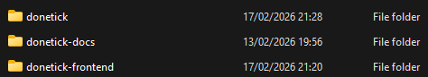
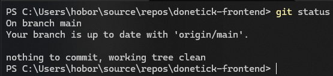
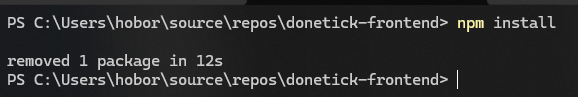
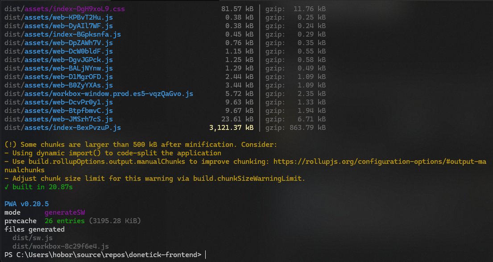
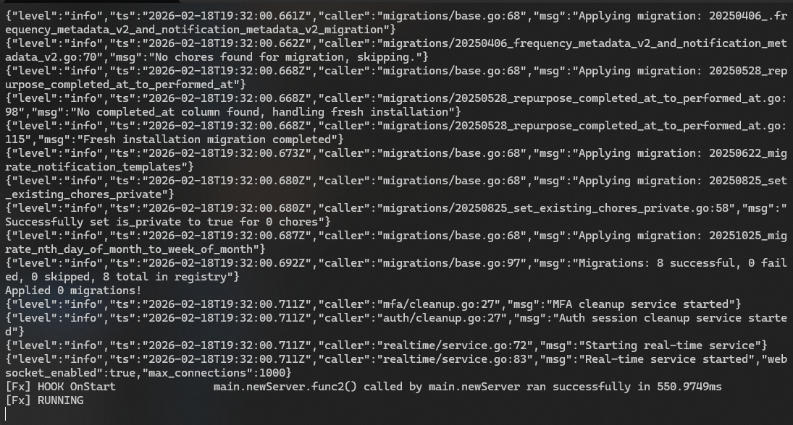
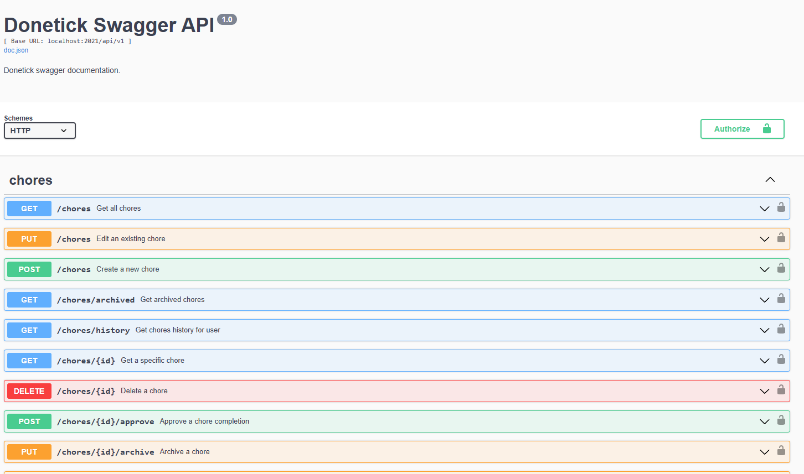

# Windows build

### Clone the repositories

Clone the backend and frontend repositories and put it next to eachother:



### Frontend



Run (Powershell Core):

```shellscript
npm install
```



Then:

```shellscript
npm run build-win
```




### Backend

Run (Powershell Core):

```shellscript
go mod download
go mod tidy
go build .
```

Set the variables in selfhosted.yaml and local.yaml for JWT secret

```yaml
jwt:
  secret: "change_this_to_a_secure_random_string_32_characters_long"
  session_time: 168h # 7 days
  max_refresh: 1440h # 60 days 
```

Copy the contents of the frontend build output to the backend repository:

```shellscript
cp -r ..\donetick-frontend\dist .\frontend
```

Run:

```shellscript
go run .
```

Should look something like this:



Now you can access the frontend on http://localhost:2021 and the apis on the [http://localhost:2021/api/v1](http://localhost:2021)

### Swagger

Comment out these lines in main.go from this:

```go
	if cfg.Name == "local" {
		r.GET("/swagger/*any", ginSwagger.WrapHandler(swaggerFiles.Handler))
	}
```

To this:

```go
// if cfg.Name == "local" {
		r.GET("/swagger/*any", ginSwagger.WrapHandler(swaggerFiles.Handler))
	// }
```

Run this in the backend root:

```shellscript
swag init
```

Save the file and rebuild and run with:

```shellscript
go build.
go run
```

Navigate to http://localhost:2021/swagger/index.html



**Use the APIKey authorization!**

